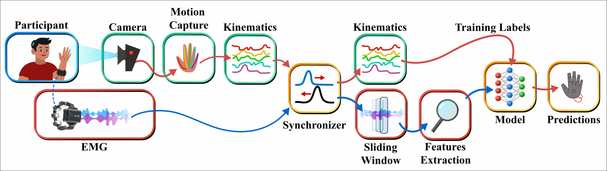
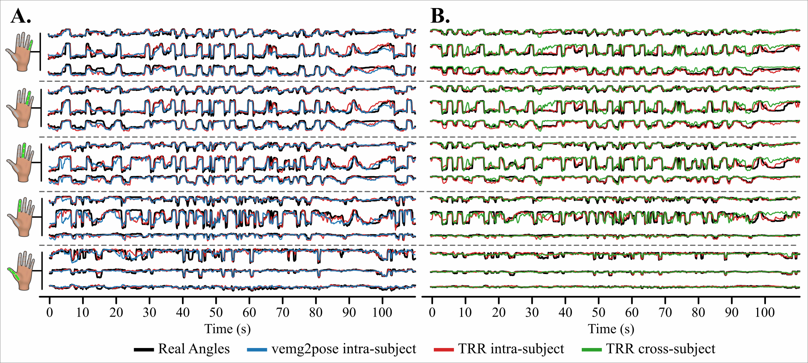
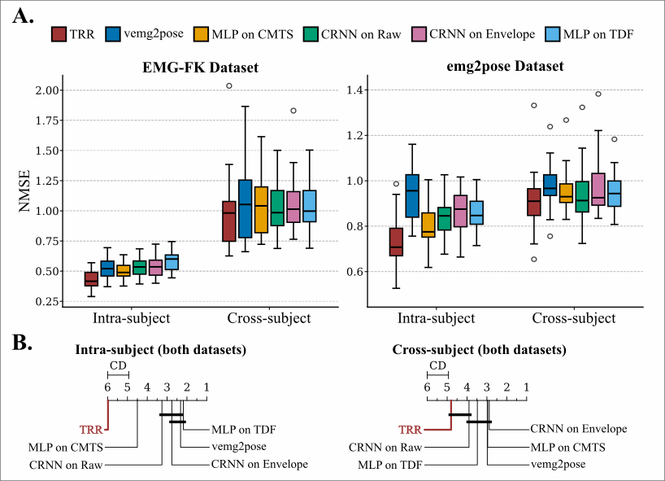

# EMG-to-fingers-joint-angles-regression

This repository contains an acquisition framework for synchronized forearm EMG and finger joint angles,
and notebooks to evaluate state-of-the-art EMG-to-joint-angles machine learning models
against our *Temporal Riemannian Regressor* (TRR) approach. 

## Acquisition framework

The acquisition framework, in `./acquisitionFramework`, uses the [__MindRove 8-channel EMG armband__](https://mindrove.com/product/emg-armband/),
a standard consumer grade camera, [__MediaPipe__](https://mediapipe.readthedocs.io/en/latest/solutions/hands.html),
and the [__Leap Hand__](https://v1.leaphand.com/) for visualization.

## Experiment

The folder `./experiments` contains notebooks for TRR implementation and benchmark evaluation.

